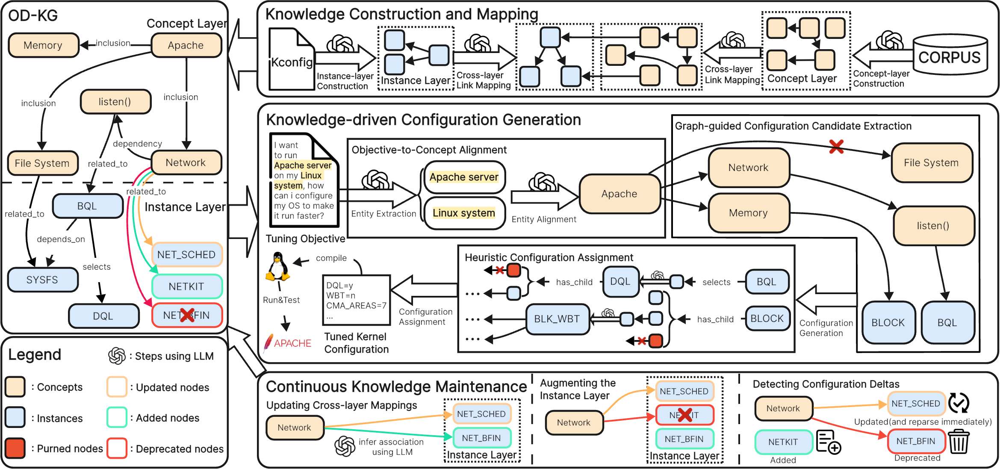

# BYOS: Knowledge-driven Large Language Models Bring Your Own Operating System More Excellent  

Official resources of **"BYOS: Knowledge-driven Large Language Models Bring Your Own Operating System More Excellent  "**. [Hongyu Lin](https://arxiv.org/search/cs?searchtype=author&query=Lin,+H), [Yuchen Li](https://arxiv.org/search/cs?searchtype=author&query=Li,+Y), [Haoran Luo](https://arxiv.org/search/cs?searchtype=author&query=Luo,+H), [Kaichun Yao](https://arxiv.org/search/cs?searchtype=author&query=Yao,+K), [Libo Zhang](https://arxiv.org/search/cs?searchtype=author&query=Zhang,+L), [Mingjie Xing](https://arxiv.org/search/cs?searchtype=author&query=Xing,+M), [Yanjun Wu](https://arxiv.org/search/cs?searchtype=author&query=Wu,+Y). [[paper](https://arxiv.org/abs/2503.09663)]

[](https://opensource.org/licenses/Apache-2.0)

## Overview



BYOS (**Bring Your Own Operating System** more excellent) is a novel knowledge-driven framework that automates Linux kernel tuning using Large Language Models (LLMs). BYOS achieves **7.1%-155.4%** performance improvements over default configurations across standard benchmarks and real-world applications.

## Key Features

- 🏗️ **Structured Knowledge Construction**: Dual-layer Knowledge Graph (OD-KG) bridges high-level tuning objectives with low-level config options.
- 🧠 **Knowledge-driven Configuration**: Mitigates LLM hallucinations through graph-guided reasoning.
- 🔄 **Continuous Knowledge Maintenance**: Incremental updates adapt to rapid kernel evolution.
- 🚀 **Performance Gains**: Up to **155.4%** improvement on UnixBench, **42.7%** latency reduction in Nginx.

## Installation

```bash
git clone https://github.com/LHY-24/BYOS.git
cd BYOS
pip install -r requirements.txt
```

## Quick Start

**1. Init environment**

```bash
# replace your OpenAI key (and base_url) in Config.py file and init_env.sh
source init_env.sh
# downloads linux kernel source code from https://www.kernel.org/pub/linux/kernel/. Use v6.2.16 as an example.
wget https://www.kernel.org/pub/linux/kernel/v6.x/linux-6.2.16.tar.gz
tar -zxf https://www.kernel.org/pub/linux/kernel/v6.x/linux-6.2.16.tar.gz
```

**2. Initialize the knowledge base**:

```python
python3 build_kg.py /path/to/linux/kernel/source_code
```

**3. Run kernel tuning**:

```python
python3 BYOS.py /path/to/linux/kernel/source_code -t "Your optimize target" -o "config output filename"
```

**4. Apply configurations**:

Move the config generated by Step 3 to linux source code directory and rename it to ".config". Then compile the linux kernel.
```bash
mv config_output /path/to/linux/kernel/source_code/.config
```

## Citation

```tex
@misc{BYOS,
  author       = {Hongyu Lin, Yuchen Li, Haoran Luo, Kaichun Yao, Libo Zhang, Mingjie Xing, Yanjun Wu},
  title        = {BYOS: Knowledge-driven Large Language Models for OS Kernel Tuning},
  year         = {2025},
  organization = {GitHub},
  url          = {https://github.com/LHY-24/BYOS},
}
```

## Feedback

Contributions and feedback are greatly appreciated! Whether you've found a bug, have a question, or want to suggest improvements, please open an issue. Your input helps make BYOS better for everyone.

For further questions, please contact: hongyu2021@iscas.ac.cn, liyuchen2021@iscas.ac.cn, [luohaoran@bupt.edu.cn](mailto:luohaoran@bupt.edu.cn).

## Acknowledgements

This repo benefits from [AutoOS](https://github.com/xuewuyinhe/AutoOS) and [Agent-R1](https://github.com/0russwest0/Agent-R1). Thanks for their wonderful works.